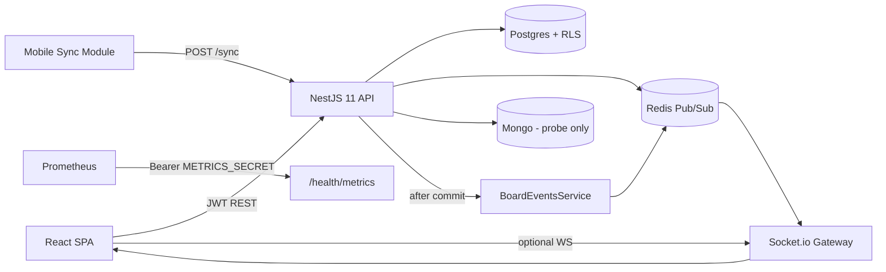

# Enhanced Production Readiness Audit — Phase 0 (2026-07-22)

**Status:** Discovery complete. **STOP** — awaiting user scope confirmation before Phase 1+.  
**Supersedes for baseline scoring:** prior campaign Phase 0 (`phase0-readiness.md`, 60/100 on 2026-07-20) and the Phase 5d claim of **100/100** as the *active* readiness baseline. Historical phase reports remain valid as uplift history; this document is the **fresh** Enhanced audit baseline.

**Canvas:** `C:\Users\verac\.cursor\projects\d-Github-Cersor-FlowLogix\canvases\phase0-readiness-2026-07-22.canvas.tsx`

**Baseline score (Enhanced rubric):** **86 / 100**

**Relation to Phase 5d 100/100:** Not a code regression. Local Nest 11 + compose + unit suites still green today. The Enhanced audit **re-weights production deployability**, remote target readiness, observability completeness, and residual domain/ops debt that Phase 5d explicitly deferred as “optional polish.”

### Reconfirmation (2026-07-22 ~19:30 +02)

**Confirmed unchanged — score remains 86/100.** Spot-check found no material change since the earlier Phase 0 write this same day:

| Check | Result |
|-------|--------|
| `git log -5` | Still on Phase 5d / Nest 11 history (`0c85f9f`…`071c7fc`); no new readiness commits |
| Local compose | PG/Mongo(`27018`)/Redis **Up ~45h (healthy)** |
| `GET /health` | **200 ok** — postgres/redis/mongo up |
| `GET /auth/me` (no token) | **401** (expected) |
| Unit suites | **128** Jest / **23** frontend / **48** mobile — all **PASS** |
| `docker-compose.prod.yml config` | **OK** (env blanks warn only; secrets not committed) |
| NEST `100.117.250.123` | TCP **22/80/443 closed**; **8081 open** (existing platform-api, not FlowLogix). **No SSH / no password spray** |

User still has **not** answered the Decision Required questions. **No Phase 1 started.**

---

## 1. Current understanding summary

**LogixFlow / FlowLogix** (`logixflow` monorepo) is a multi-tenant collaborative Kanban platform.

| Layer | Path | Role (verified 2026-07-22) |
|-------|------|----------------------------|
| API | `backend/` | NestJS **11.1.28**: boards/lists/cards/comments, JWT auth + global guard, Postgres RLS tenant context (`app.current_tenant_id`), Base62 fractional `position_idx`, Socket.io realtime via Redis Pub/Sub (post-commit), `POST /sync` field-level LWW, health + Prometheus metrics |
| Web | `frontend/` | React + Vite **8** + Tailwind + Zustand; Atlaskit pragmatic DnD; JWT+REST hydrate when `VITE_API_URL` set; WS optional; offline demo otherwise |
| Mobile | `mobile/` | Offline-first LWW-CRDT + attachment queue behind ports (WatermelonDB models); **not** a full RN app shell |
| Local data | `docker-compose.yml` | Postgres :5432, Mongo :27018, Redis :6379 — **all healthy** this session |
| Prod stack | `docker-compose.prod.yml` | Nginx TLS, 3 API replicas, Redis master/replica, Prometheus, Grafana, Alertmanager — **config validates**; full bring-up not run (host RAM / co-resident stacks) |
| CI | `.github/workflows/deploy.yml` | Lint/test backend+frontend+mobile; GHCR push on `main`; compose health e2e on `workflow_dispatch` only |
| Ops docs | `deploy/OPS.md`, `HA-TABLETOP.md`, `deploy/load/` | Runbooks + prior live HA evidence (2026-07-20) |

**Core workflows (from code + live smoke):**
1. Login → JWT (`POST /auth/login`); tenant `orgId` from token (`ActiveOrgId`), not `X-Org-Id`.
2. CRUD under `runInTenantContext` + FORCE RLS (boards → chained lists/cards/comments).
3. Card/list ordering via `PositionService` / `FractionalIndexer`; daily rebalance cron.
4. After DB commit → `BoardEventsService` → Redis → `board:room:{boardId}` → Socket.io.
5. Mobile `POST /sync` LWW including `positionIdx` + parent refs; delta-pull via `sinceCheckpoint`.
6. SPA API mode: optimistic DnD + rollback; `needsResync` → `refetchBoard`.

**Deploy targets:**
| Target | Status (2026-07-22) |
|--------|---------------------|
| Local dev (this machine) | **Green** — compose healthy; API `:3000` `/health` **200 ok** (PG/Redis/Mongo up) |
| NEST Tailscale `100.117.250.123` | **Blocked** — no SSH; prior account lockout; **no password retry** this session |
| Public staging/prod URL | **Not found** in repo (prior probe: no FlowLogix `/health` on known hosts) |

---

## 2. Architecture overview

**Stack evidence:** TypeScript strict; Nest 11 + TypeORM/`pg`; Redis client; Socket.io; React 18 + Vite 8 + Vitest 4 (frontend); mobile Vitest 2.x; Jest 20 suites / 128 tests backend.

---

## 3. Proposed 100-point rubric (tailored — confirm weights)

| Category | Max | Full points means for THIS system |
|----------|-----|-----------------------------------|
| Architecture | 10 | Clear tenant boundaries; DB write decoupled from WS; sync path E2E; each datastore justified or gated |
| Code Quality | 10 | Strict TS / no `any`; ValidationPipe; global HTTP filter; rules-aligned DnD (Atlaskit); Nest 11 pins stable |
| Security | 15 | JWT+RLS enforced; helmet/throttle; metrics ACL; secret hygiene; vuln backlog controlled; auth model production-grade |
| Reliability | 10 | Health+HA verified on intended deploy target; fail-closed tenant; optimistic rollback; sync covers ordering |
| Testing | 15 | Unit coverage for auth/CRUD/ordering/realtime/sync; CI runs all workspaces; meaningful e2e on release path |
| Observability | 10 | Metrics + actionable alerts + dashboards; alert routing live; structured ops story (traces optional stretch) |
| Documentation | 10 | README/auth/ops match code; failover runbooks with evidence |
| Performance | 5 | Documented load/SLO targets; rebalance proven; load smoke runnable |
| DevOps | 5 | CI verify+deploy artifacts; reproducible envs; **at least one** non-local deploy path proven or explicitly out of scope |
| Specialized / Domain | 10 | Multi-tenant Kanban: RLS, fractional indexing, realtime, CRDT sync, HA health-gates — production-complete |

**Default weights as above.** User may rebalance (e.g. raise DevOps/Reliability if remote NEST is in-scope).

---

## 4. Baseline scorecard (evidence 2026-07-22)

| Category | Score | Evidence |
|----------|------:|----------|
| Architecture | 9/10 | Modules, RLS chain, post-commit Redis→WS, sync v2 present. Mongo still probe-only (kept by decision). |
| Code Quality | 9/10 | Nest 11.1.28 + overrides; helmet + `APP_FILTER` + throttler; Atlaskit DnD. Jest warns of open handles / force exit. |
| Security | 13/15 | Global JWT guard; org from JWT; FORCE RLS; `npm audit` **0** vulns (backend+frontend workspaces); metrics ACL designed (open locally when `METRICS_SECRET` unset + non-prod — observed `/health/metrics` **200**). Gaps: no OAuth/SSO; seed password in README; NEST secret rotation needed after prior lockout. |
| Reliability | 8/10 | Live `/health` **200** today; Phase 5d local PG/Redis/Mongo failover documented. Full 3-API prod compose never live; **no remote** HA. |
| Testing | 12/15 | **128** Jest / **23** frontend Vitest / **48** mobile Vitest — all PASS this session. CI covers units; e2e job is **dispatch-only**; `backend/test/app.e2e-spec.ts` is minimal bootstrap stub. |
| Observability | 7/10 | Prometheus metrics + 6 alert rules + Grafana provisioning + Alertmanager config. Receiver is **placeholder webhook** (`127.0.0.1:9`). No distributed tracing. |
| Documentation | 9/10 | README, `OPS.md`, `HA-TABLETOP.md`, CLAUDE.md, phase summaries aligned with code. |
| Performance | 4/5 | `deploy/load/` (Node smoke + optional k6); rebalance cron. SLOs not user-confirmed this audit. |
| DevOps | 3/5 | CI verify + GHCR path exists; prod compose **config OK**. NEST deploy **blocked**; no staging URL; TLS certs dir expected empty until provisioned. |
| Specialized / Domain | 9/10 | RLS + fractional + realtime + CRDT sync implemented and unit-tested. Mobile = library/module, not shippable RN app. |

### **Total: 86 / 100**

| Comparator | Score | Meaning |
|------------|------:|---------|
| Phase 0 (2026-07-20) | 60 | Pre-uplift discovery |
| Phase 5d (2026-07-20) | 100 | Local uplift campaign complete |
| **Enhanced Phase 0 (today)** | **86** | Fresh production-readiness baseline including deploy posture |

---

## 5. Prioritized gap list

| ID | Gap | Impact | Effort | Risk | Priority |
|----|-----|--------|--------|------|----------|
| G1 | No proven remote deploy (NEST blocked; no staging URL) | High | Med–High | High (ops) | P0 |
| G2 | Full `docker-compose.prod.yml` never brought up on a host with free RAM | Med | Med | Med | P1 |
| G3 | Alertmanager webhook placeholder — alerts don’t page anyone | Med | Low | Med | P1 |
| G4 | CI e2e only on `workflow_dispatch`; thin Nest e2e stub | Med | Med | Low | P2 |
| G5 | Jest open-handle / worker force-exit | Low | Low | Low | P3 |
| G6 | Mongo probe-only (architecture tax) | Low | High (if domain) | Low | P3 (keep unless product needs docs store) |
| G7 | OAuth2/SSO absent (local JWT only) | Med (enterprise) | High | Med | Confirm scope |
| G8 | No distributed tracing | Low–Med | Med | Low | Confirm weight |
| G9 | Mobile not a full RN shell | Med (if mobile GA) | High | Med | Confirm scope |
| G10 | Seed credentials documented in README | Low–Med | Low | Med | P2 before public prod |

---

## 6. Edge cases & failure modes

| Scenario | Current behaviour / risk |
|----------|--------------------------|
| Datastore down | `/health` → **503 degraded** (required probes); Phase 5d proved recover |
| Tenant unset / wrong org | RLS fail-closed + JWT org — zero/wrong rows |
| Redis hang under stop | Prior drill: probe timeout before 503; clients may stall WS |
| Metrics scrape without secret in prod | Fail-closed **401** when `NODE_ENV=production` and secret unset |
| Offline mobile insert | Sync inserts UUID when parent in-org; invalid keys dropped with clocks |
| Optimistic DnD failure | Frontend rolls back on non-2xx PATCH |
| NEST deploy without SSH | **Blocked** — RDP/WinRM/SMB paths previously fragile; account lockout risk |
| Host RAM pressure | Full prod compose + chat/whatsapp co-resident stacks compete |
| Alert fire | Alertmanager config valid but placeholder sink — silent drop |

---

## 7. Part A — Apply recommended (reconfirmed 2026-07-22 ~19:30)

| Action | Result |
|--------|--------|
| Local compose (PG/Mongo/Redis) | **Already up** ~45h; all **healthy**; Mongo host **27018** |
| API `/health` | **200 ok** — postgres/redis/mongo up (API on `:3000`) |
| `/auth/me` unauthenticated | **401** (expected) |
| Unit suites | 128 / 23 / 48 **PASS** (~11s / ~2s / ~0.4s) |
| Prod compose `config` | **OK** (blank-env warnings only; secrets not recorded / not committed) |
| NEST `100.117.250.123` deploy | **Still blocked** — SSH 22 closed; no password spray |
| Commit `.env` / secrets | **Not done** (correct) |

---

## 8. User Decision Required / Ready for review?

**STOP before Phase 1.** Please confirm or correct:

### Scope confirmation
1. Is the Enhanced audit target **(A)** local/controlled-host readiness, **(B)** NEST Tailscale deploy, **(C)** a different staging/prod URL, or **(D)** all of the above?
2. Accept baseline **86/100** and rubric weights, or request reweight (list category ± points)?
3. Exclusions: keep Mongo probe-only? Defer SSO? Defer full RN shell? Defer tracing?

### Extra context needed
4. **Domain / compliance:** any SOC2/ISO/HIPAA/POPIA requirements that change Security/Observability weights?
5. **SLOs:** target availability, p95 latency, error budget for board moves / sync?
6. **NEST unlock:** preferred access path after unlock (OpenSSH / Tailscale SSH / RDP-only compose)? Who rotates credentials?
7. **Alert routing:** real webhook (Slack/Teams/PagerDuty) URL for Alertmanager?
8. **Phase 1 scope preference:** Quick Wins only (G3/G4/G5/G10) vs include remote deploy (G1)?

**Ready for review?** Reply with corrections + answers above. No Phase 1–5 remediations will start until you confirm.
