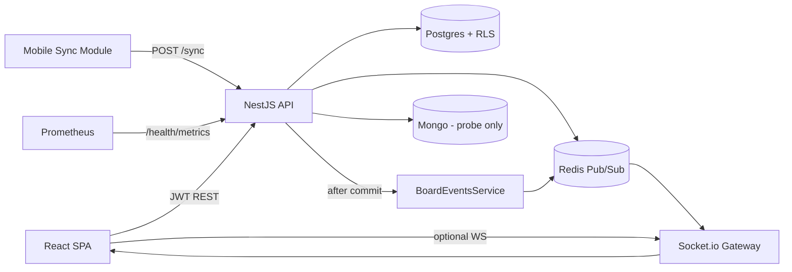

# Phase 0 — Production Readiness Discovery (2026-07-20)

**Status:** Discovery complete. Phase 1 Quick Wins + Phase 2 Core Hardening applied 2026-07-20 — see `.index/module-summaries/phase1-quick-wins.md` and `phase2-core-hardening.md`.

**Canvas:** `C:\Users\verac\.cursor\projects\d-Github-Cersor-FlowLogix\canvases\phase0-readiness-scorecard.canvas.tsx`

**Baseline score:** **60 / 100**

---

## 1. Current understanding summary

**LogixFlow / FlowLogix** is a multi-tenant collaborative Kanban platform (monorepo `logixflow`).

| Layer | Role |
|-------|------|
| `backend/` | NestJS API: orgs/users/boards/lists/cards/comments/members, JWT auth, Postgres RLS tenant isolation, fractional `position_idx`, Socket.io realtime via Redis Pub/Sub, `POST /sync` LWW merge for mobile, health + Prometheus metrics |
| `frontend/` | React + Vite + Tailwind + Zustand board SPA; branded Veralogix UI; optional live WS; currently demo/local-first without REST hydration |
| `mobile/` | Offline-first LWW-CRDT sync + attachment upload queue behind injectable ports (WatermelonDB models); not a full RN app shell |
| `docker-compose.yml` | Local Postgres :5432, Mongo :27018 (remapped), Redis :6379 |
| `docker-compose.prod.yml` | Nginx TLS edge, 3 API replicas, Redis master/replica, Prometheus, Grafana |
| CI | `.github/workflows/deploy.yml` — lint/test backend, lint/build frontend, push images to GHCR on `main` |

**Core workflows (from code):**
1. Login → JWT (`POST /auth/login`); tenant `orgId` from token (`ActiveOrgId`), not `X-Org-Id`.
2. CRUD boards → lists → cards → comments under tenant transaction + RLS.
3. Card/list move with Base62 fractional keys; daily rebalance cron.
4. After commit: publish delta to `board:room:{boardId}` via Redis → Socket.io clients.
5. Mobile: local mutations + clocks → `POST /sync` field-level LWW (content fields; not `position_idx` yet).

---

## 2. Architecture overview

**Languages / frameworks:** TypeScript (strict), NestJS 10, TypeORM + `pg`, `mongodb` driver (probe), Redis client, Socket.io, React 18, Vite, Zustand, Tailwind, `@hello-pangea/dnd`, Vitest/Jest, WatermelonDB (mobile).

**Runtime:** Node 20+, Docker Compose local/prod. Prod images via GHCR. No remote staging/prod URL discovered in repo env.

---

## 3. Proposed 100-point rubric (tailored)

| Category | Max | Full points means for THIS system |
|----------|-----|-----------------------------------|
| Architecture | 10 | Tenant boundaries clear; DB write decoupled from WS; sync path end-to-end; each datastore justified |
| Code Quality | 10 | Strict TS, no `any`, ValidationPipe, global HTTP exception filter, rules-aligned DnD |
| Security | 15 | JWT+RLS enforced, headers/rate limits, secret hygiene, vuln backlog controlled, metrics auth-aware |
| Reliability | 10 | Health+HA verified, fail-closed tenant, optimistic rollback proven, sync covers ordering |
| Testing | 15 | Unit+e2e for auth/CRUD/RLS/realtime/sync; CI covers backend+frontend+mobile |
| Observability | 10 | Metrics+structured logs+traces+alert rules on prod path |
| Documentation | 10 | README/auth model match code; ops runbooks for failover |
| Performance | 5 | Documented load targets; rebalance proven; no unused datastore tax |
| DevOps | 5 | CI verify+deploy; workspaces+mobile; reproducible envs |
| Specialized/Domain | 10 | Multi-tenant Kanban + realtime + offline LWW production-complete |

---

## 4. Baseline scorecard (evidence-based)

| Category | Score | Justification |
|----------|------:|---------------|
| Architecture | 7/10 | Nest modules, RLS chain, Redis→WS, CRDT sync present. Mongo unused beyond health. SPA not API-hydrated. |
| Code Quality | 7/10 | Strict TS; ValidationPipe whitelist; no real `any`. Missing global HTTP `APP_FILTER`. DnD ≠ `.cursorrules`. |
| Security | 8/15 | Global `JwtAuthGuard`; org from JWT; FORCE RLS + `logixflow_app`. No helmet/throttle; `/health/metrics` public; npm audit 35 (1 critical); default JWT secret in examples. |
| Reliability | 6/10 | `/health` probes ok locally; prod HA designed not verified; sync omits `position_idx`; frontend still demo-oriented. |
| Testing | 8/15 | 23 specs (16 backend / 2 frontend / 5 mobile) on indexer, sync-merge, auth, realtime, health. No CRUD service specs; mobile not in CI verify; e2e not exercised in CI. |
| Observability | 7/10 | Winston JSON, `prom-client`, Grafana dashboard, HTTP latency interceptor. No tracing/alert rules. |
| Documentation | 5/10 | Strong `CLAUDE.md` / `.cursorrules`. Root + `backend/README` still document spoofable `X-Org-Id`. |
| Performance | 2/5 | FractionalIndexer + rebalance designed well; no load suite. |
| DevOps | 3/5 | Local+prod compose; GHCR push. Mobile absent from CI; no deploy-to-host job. |
| Domain | 7/10 | RLS/ordering/WS/CRDT solid. Gaps: REST hydration, pragmatic-dnd, sync v1 content-only. |
| **Total** | **60/100** | |

---

## 5. Prioritized gap list

| Priority | Gap | Impact | Effort | Risk |
|----------|-----|--------|--------|------|
| P1 | Wire SPA to REST + JWT auth (replace demo store as sole source) | High | M | High |
| P2 | Address npm audit critical/high (35 total) | High | S–M | High |
| P3 | Global HTTP exception filter + security headers / rate limiting | High | S | Med |
| P4 | Fix stale `X-Org-Id` docs vs JWT `ActiveOrgId` | Med | S | Med |
| P5 | `needsResync` → targeted board refetch client | High | M | Med |
| P6 | CI: mobile tests + workspace install; add e2e smoke | Med | M | Med |
| P7 | Sync: `position_idx` + offline-created inserts | High | L | High |
| P8 | Migrate `@hello-pangea/dnd` → `@atlaskit/pragmatic-drag-and-drop` | Med | M | Low |
| P9 | Clarify or remove Mongo (probe-only today) | Med | S | Low |
| P10 | Verify prod compose HA + add Prometheus alert rules | High | L | Med |

---

## 6. Edge cases & failure modes (discovered)

1. **RLS setting drift** — policy uses `app.current_tenant_id`; if app/migrations diverge, fail-closed = empty boards (documented in CLAUDE.md).
2. **Owner-role bypass** — app must use `logixflow_app`; connecting as `POSTGRES_USER` bypasses RLS.
3. **Fractional key bloat** — mid-inserts lengthen keys; rebalance cron at 3AM is the guard; if Nest down, bloat accumulates.
4. **Content WS frames** — `*.created`/`*.updated` only set `needsResync`; without REST refetch, UI stays stale until manual refresh.
5. **Sync v1 scope** — offline position moves / new records not merged via `/sync`; divergence until CRUD path used.
6. **Mongo required for “ok” health** — unused for domain data but probe failure → `degraded`/503.
7. **Multi-replica WS** — requires Redis pub/sub; without it, sticky sessions only see local publishes.
8. **Host port contention** — Mongo remapped to 27018 due to `chat-mongodb` on 27017; misconfigured `MONGO_URI` breaks health.
9. **Public metrics** — `/health/metrics` is `@Public()`; scrapable without auth (info disclosure risk).
10. **Optimistic UI** — rules require rollback on non-2xx; SPA has no mutation API client yet, so path unproven end-to-end.

---

## 7. User Decision Required — Ready for review?

Please confirm before Phase 1+:

1. Is the system understanding above correct? Corrections?
2. In-scope for readiness: backend only / +frontend / +mobile / +prod compose?
3. Compliance targets (SOC2, GDPR, HIPAA, none)?
4. Performance SLOs (p95 latency, concurrent boards, RPO/RTO)?
5. Keep default 100-pt weights or reweight (e.g. Security 20, Domain 15)?
6. Exclude anything (Mongo retirement, SSO deferral, mobile app shell)?
7. Approve Phase 1 remediation kickoff after answers?

---

## Bootstrap evidence (Part A)

| Item | Status | Evidence |
|------|--------|----------|
| `docker compose up -d` | Green | `logixflow-postgres/mongodb/redis` Up (healthy); Mongo `0.0.0.0:27018` |
| Ports 5432 / 27018 / 6379 | Green | `Test-NetConnection` TcpTestSucceeded=True ×3 |
| `npm install` | Green | 957 packages; 35 vulns reported |
| `backend/.env` | Green | Present; `MONGO_URI` …`:27018` (not committed) |
| `migration:run` | Green | 6/6 migrations executed + COMMIT |
| `GET /health` | Green | HTTP 200 `status:ok` postgres/redis/mongo up |
| No force-push / no commit / no volume delete | Green | Constraints honored |
